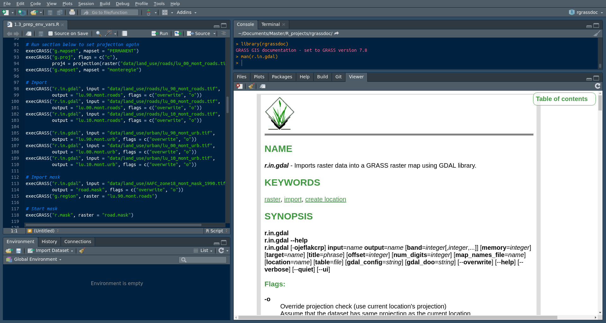

<!-- README.md is generated from README.Rmd. Please edit that file -->

```{r, include = FALSE}
knitr::opts_chunk$set(
  collapse = TRUE,
  comment = "#>",
  fig.path = "man/figures/README-",
  out.width = "100%"
)
```

# rgrassdoc 

<!-- badges: start -->
[](http://www.gnu.org/licenses/gpl-3.0)
[](https://github.com/VLucet/rgrassdoc/actions)
[](https://codecov.io/gh/VLucet/rgrassdoc?branch=master)

[](https://CRAN.R-project.org/package=rgrassdoc)
[](https://CRAN.R-project.org/package=rgrassdoc/)
<!-- badges: end -->

Are you a user of `rgrass7`, the R interfacte to GRASS GIS? Do you find yourself looking at the online GRASS manuals all the time? `rgrassdoc` provide two simple functions, `man` and `browse`, which allow you to visualize the GRASS GIS manual page for any GRASS module, right in the RStudio Viewer pane (or to easily open the manual page in your browser). The goal is to fluidify your workflow when using `rgrass7`. 

### Installation

Install from CRAN as such:

``` r
install.packages("rgrassdoc")
```

You can also install the dev version from GitHub like so:

``` r
devtools::install_github("vlucet/rgrassdoc")
```

### Example

The `man` function supports non standard evaluation for even less typing and faster access to the information:

```{r example, eval = TRUE}
library(rgrassdoc)

man(r.in.gdal)
```

`man` also supports partial matching:
```{r partial, eval = TRUE}
man(r.gdal)
```
You can also open the page in your browser with `browse`. Your browser will then of course support links to other pages of the manual:

```{r cars, eval = FALSE}
browse(v.overlay)
```

Using the RStudio viewer pane, this is what you can expect to see:


