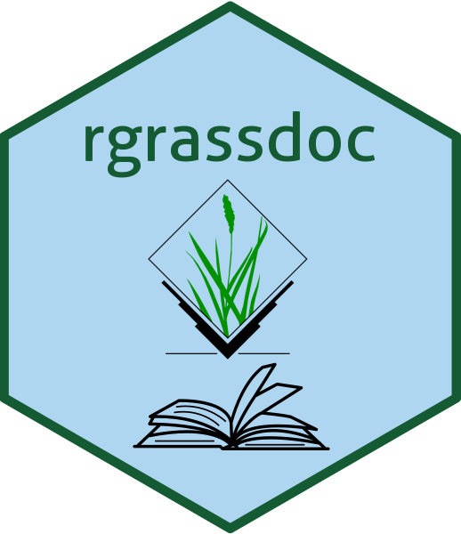
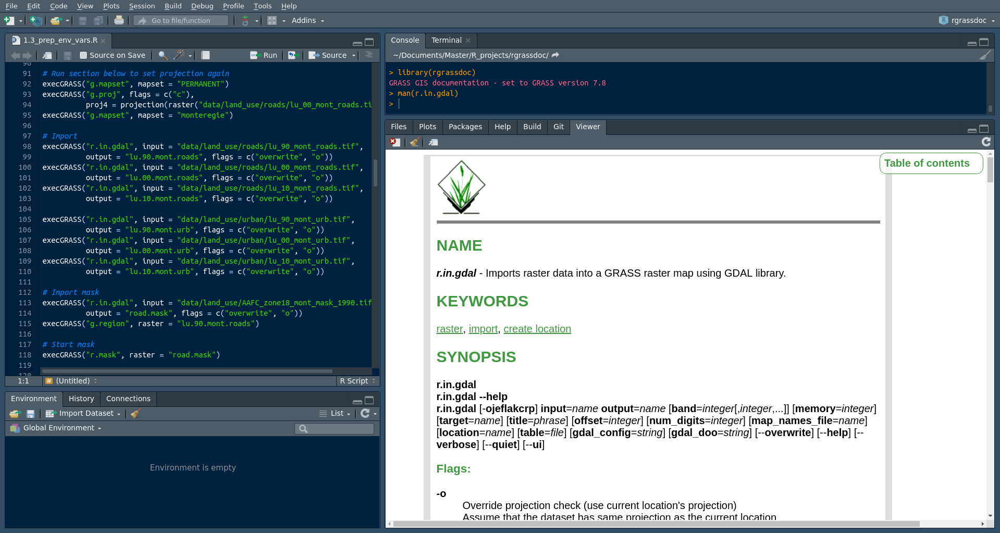

<!-- README.md is generated from README.Rmd. Please edit that file -->

# rgrassdoc 

<!-- badges: start -->

[](http://www.gnu.org/licenses/gpl-3.0)
[](https://github.com/VLucet/rgrassdoc/actions)
[](https://codecov.io/gh/VLucet/rgrassdoc?branch=master)
<!-- badges: end -->

Are you a user of `rgrass7`, the R interfacte to GRASS GIS? Do you find
yourself looking at the online GRASS manuals all the time? `rgrassdoc`
provide two simple functions, `man` and `browse`, which allow you to
visualize the GRASS GIS manual page for any GRASS module, right in the
RStudio Viewer pane (or to easily open the manual page in your browser).
The goal is to fluidify your workflow when using `rgrass7`.

### Installation

You can install from GitHub like so:

``` r
devtools::install_github("vlucet/rgrassdoc")
```

### Example

The `man` function supports non standard evaluation for even less typing
and faster access to the information:

``` r
library(rgrassdoc)
#> ℹ GRASS GIS documentation - set to GRASS version 7.8

man(r.in.gdal)
#> ✓ Displaying module r.in.gdal in viewer
#> Session is not interactive - viewer cannot be used
```

`man` also supports partial matching:

``` r
man(r.gdal)
#> x No manual entry exists for module r.gdal
#> → Did you mean:
#>    r.in.gdal
#>    r.out.gdal
#> ✓ Displaying module r.in.gdal in viewer
#> Session is not interactive - viewer cannot be used
```

You can also open the page in your browser with `browse`. Your browser
will then of course support links to other pages of the manual:

``` r
browse(v.overlay)
```

Using the RStudio viewer pane, this is what you can expect to see:


